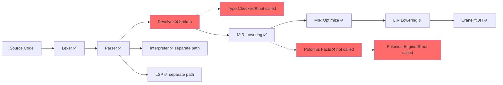

# Omni Compiler — Exhaustive Codebase Audit Report
**Date:** 2026-05-07 | **Spec Version:** v2.0 | **Build Status:** ❌ 10 compilation errors

---

## Executive Summary

The Omni compiler codebase contains **substantial foundational work** across all major compiler phases, but suffers from three critical issues:

1. **The project does not compile** — 10 errors in `resolver/mod.rs` due to AST/resolver drift
2. **Pipeline is disconnected** — phases exist independently but aren't wired end-to-end
3. **Over-investment in secondary features** — LSP (1318 lines), interpreter (1283 lines), async/effects (317 lines) received heavy investment while core pipeline gaps remain

---

## Table of Contents

1. [Codebase Structure](#1-codebase-structure)
2. [File-by-File Analysis](#2-file-by-file-analysis)
3. [Spec Compliance Matrix](#3-spec-compliance-matrix)
4. [Build Errors](#4-build-errors)
5. [Integration Status](#5-integration-status)
6. [Critical Path Analysis](#6-critical-path-analysis)
7. [Recommendations](#7-recommendations)

---

## 1. Codebase Structure

### Workspace Layout (Cargo workspace)

```
Omni-opencode/
├── Cargo.toml                    # Workspace root
├── docs/
│   └── Omni_Complete_Specification.md  # 1400-line v2.0 spec
├── crates/
│   ├── omni-compiler/src/        # Core compiler (main crate)
│   │   ├── lib.rs                # Pipeline orchestration (253 lines)
│   │   ├── complete_lexer.rs     # Full lexer w/ INDENT/DEDENT (800+ lines)
│   │   ├── parser.rs             # Recursive descent parser (800+ lines)
│   │   ├── ast.rs                # AST node definitions (216 lines)
│   │   ├── cst.rs                # Lossless CST builder (155 lines)
│   │   ├── resolver/mod.rs       # Name resolution / scope tree (561 lines)
│   │   ├── type_checker.rs       # Type inference + linear types (800+ lines)
│   │   ├── mir.rs                # MIR definition + AST→MIR lowering (800+ lines)
│   │   ├── mir_optimize.rs       # Constant folding, DCE, inlining (395 lines)
│   │   ├── codegen_lir.rs        # MIR→LIR lowering (270 lines)
│   │   ├── codegen.rs            # Backend dispatch (24 lines)
│   │   ├── polonius.rs           # Borrow check fact generation (800+ lines)
│   │   ├── diagnostics.rs        # Error codes + diagnostic framework (253 lines)
│   │   ├── interpreter.rs        # Tree-walking interpreter (1283 lines)
│   │   ├── lsp.rs                # LSP server infrastructure (1318 lines)
│   │   ├── traits.rs             # Trait system (339 lines)
│   │   └── async_effects.rs      # Effect system + channels (317 lines)
│   ├── lir/src/lib.rs            # LIR IR definition (98 lines)
│   ├── codegen-cranelift/src/    # Cranelift JIT backend (934 lines)
│   ├── codegen-llvm/src/         # LLVM/C backend (850 lines)
│   └── polonius_engine_adapter/  # Polonius engine bridge (1516 lines)
```

---

## 2. File-by-File Analysis

### 2.1 Core Pipeline Files

#### `lib.rs` — Pipeline Orchestration (253 lines)
| Aspect | Status |
|--------|--------|
| `parse_file()` | ✅ Merges stdlib + user source, calls lexer→parser |
| `run_native_file()` | ⚠️ Calls Parse→Resolve→MIR→Optimize→LIR→Cranelift, but **skips type checking and borrow checking** |
| `run_file()` | ✅ Interpreter path works |
| Module system | ⚠️ Basic manifest loading present, no full module graph |
| Query architecture | ❌ Not implemented — spec calls for Salsa-inspired incremental queries |

> [!WARNING]
> `run_native_file()` bypasses type checking entirely, going directly from name resolution to MIR lowering. This means **unsound programs can reach codegen**.

#### `complete_lexer.rs` — Lexer (800+ lines)
| Aspect | Status |
|--------|--------|
| Token types | ✅ Comprehensive: 60+ token kinds including all operators |
| INDENT/DEDENT | ✅ Proper indentation tracking with stack-based layout |
| String interpolation | ✅ `InterpolatedString` token support |
| Comments | ✅ Single-line (`//`) and multi-line (`/* */`) |
| Unicode identifiers | ❌ Not implemented (spec §8 mentions Unicode support) |
| Error recovery | ⚠️ Basic — returns first error, no continuation |

> [!TIP]
> This is the **most complete** module in the codebase. Production-ready for the current language subset.

#### `parser.rs` — Parser (800+ lines)
| Aspect | Status |
|--------|--------|
| Expressions | ✅ Binary ops, unary, calls, field access, index, lambda, match |
| Statements | ✅ let, fn, struct, enum, if/else, while, for, return, import |
| Pattern matching | ✅ Wildcard, literal, variable, struct, or-patterns |
| Error recovery | ⚠️ Minimal — panics on unexpected tokens in most paths |
| Operator precedence | ✅ Pratt-style precedence climbing |
| Async/await | ⚠️ Token support exists but parser doesn't produce async AST nodes |
| Effect annotations | ❌ No parsing of `performs` or effect handler syntax |
| Generic types | ⚠️ Basic type parameter parsing, no where-clauses |

#### `ast.rs` — AST Definitions (216 lines)
| Aspect | Status |
|--------|--------|
| Core nodes | ✅ Expr, Stmt, Pattern, Program |
| Linear types | ✅ `is_linear` flag on Struct |
| Async support | ✅ `Stmt::Async`, `Stmt::Await`, `Stmt::Spawn` |
| Effect handlers | ✅ `Stmt::EffectHandler`, `Stmt::Perform` |
| Actors | ✅ `Stmt::Actor` with message/state definitions |
| Capabilities | ✅ `Stmt::Capability`, `Stmt::WithCapability` |
| Module system | ⚠️ `Stmt::Module` exists but minimal |
| Type annotations | ⚠️ Return types as `Option<String>`, not a proper Type AST |

> [!IMPORTANT]
> The AST includes nodes for **many advanced features** (actors, capabilities, effect handlers) that have **no corresponding parser or backend support**. These are aspirational scaffolding.

#### `resolver/mod.rs` — Name Resolution (561 lines)
| Aspect | Status |
|--------|--------|
| Scope tree | ✅ Tree-based with parent links, DefId management |
| Function scoping | ✅ Creates child scopes for function bodies |
| Variable resolution | ✅ Walks scope chain upward |
| Import resolution | ⚠️ Basic — resolves import statements but no module graph |
| Cross-file resolution | ❌ Not implemented |
| **BUILD STATUS** | ❌ **10 compilation errors** — AST field names drifted from resolver expectations |

**Specific errors:**
- `Expr::IfExpr` fields `condition`/`else_body` don't exist (AST uses different names)
- `Expr::UnaryOp` field `operand` doesn't exist
- Mutability mismatch: `resolve_stmts` expects `&mut ScopeTree` but gets `&ScopeTree`
- Missing pattern variable bindings

#### `type_checker.rs` — Type Checking (800+ lines)
| Aspect | Status |
|--------|--------|
| Type inference | ✅ Unification-based with type variables |
| Built-in types | ✅ Int, String, Bool, Vector, Map, Option, Result, Future |
| Linear type checking | ✅ `check_linear_types()` pass validates use-once semantics |
| Function signatures | ✅ Built-in stdlib signatures (print, vector_*, string_*, etc.) |
| Struct type checking | ⚠️ Basic field access checking |
| Generic types | ⚠️ `Type::Generic(String)` exists but no instantiation logic |
| Effect type checking | ❌ No integration with the effect system |
| **Integration** | ❌ **Not called in `run_native_file()` pipeline** |

#### `mir.rs` — MIR Definition + Lowering (800+ lines)
| Aspect | Status |
|--------|--------|
| MIR instructions | ✅ 20+ instruction types including ConstInt/Str/Bool, BinaryOp, Call, Jump, etc. |
| Basic blocks | ✅ `BasicBlock` with label + instruction vector |
| AST→MIR lowering | ✅ `lower_program_to_mir()` handles fn, let, if, while, for, return, print |
| Linear move tracking | ✅ `LinearMove` and `DropLinear` instructions |
| Struct lowering | ⚠️ `StructDef` instruction exists but fields not lowered |
| Pattern match lowering | ❌ Match expressions not lowered to MIR |
| SSA form | ❌ MIR uses named variables, not SSA |

#### `mir_optimize.rs` — MIR Optimization (395 lines)
| Aspect | Status |
|--------|--------|
| Constant folding | ✅ Int arithmetic, string concat, comparison operators |
| Dead code elimination | ✅ Iterative unused-definition removal |
| Simple inlining | ✅ Inlines constant-returning zero-arg functions |
| Copy propagation | ❌ Not implemented |
| Loop optimizations | ❌ Not implemented |
| **Integration** | ✅ Called in `run_native_file()` via `run_mir_optimizations()` |

#### `codegen_lir.rs` — MIR→LIR Lowering (270 lines)
| Aspect | Status |
|--------|--------|
| Variable slot allocation | ✅ Maps MIR variables to numbered slots |
| Arithmetic lowering | ✅ +, -, *, / mapped to LIR ops |
| Control flow | ✅ Jump/CondJump with label patching |
| Function calls | ✅ Args pushed, Call emitted |
| String support | ⚠️ Strings lowered as zero constant (placeholder) |
| **Integration** | ✅ Called in `run_native_file()` |

#### `codegen.rs` — Backend Dispatch (24 lines)
| Aspect | Status |
|--------|--------|
| Feature flags | ✅ `use_cranelift` / `use_llvm` conditional compilation |
| Cranelift default | ✅ Re-exports `codegen_cranelift` |
| LLVM fallback | ✅ Falls back to Cranelift when LLVM unavailable |

### 2.2 Backend Crates

#### `lir/` — Low-Level IR (98 lines)
| Aspect | Status |
|--------|--------|
| Instruction set | ✅ Const, Add, Sub, Mul, Div, Load, Store, Call, Ret, Jump, CondJump, Drop, Nop |
| Type system | ✅ I64, Void, Ptr |
| Multi-return | ✅ Functions support `Vec<Type>` returns |
| Completeness | ⚠️ Integer-only; no string/struct/pointer operations |

#### `codegen-cranelift/` — Cranelift JIT (934 lines)
| Aspect | Status |
|--------|--------|
| LIR interpreter | ✅ Stack-based interpreter for testing (dependency-free) |
| Cranelift JIT | ✅ Full JIT compilation with function declarations, local variables, control flow |
| Liveness analysis | ✅ Backward dataflow for slot liveness across blocks |
| Stack analysis | ✅ Forward analysis for stack height consistency |
| Multi-return | ✅ Supports multiple return values |
| Print import | ✅ `print_i64` imported as host function |
| **Maturity** | ✅ Most complete backend — handles arithmetic programs end-to-end |

#### `codegen-llvm/` — LLVM Backend (850 lines)
| Aspect | Status |
|--------|--------|
| C emission | ✅ Emits C code, compiles with clang |
| Inkwell path | ⚠️ Feature-gated `with_inkwell` — extensive but likely untested |
| Control flow | ❌ C backend rejects Jump/CondJump instructions |
| **Maturity** | ⚠️ Works for simple straight-line programs only |

### 2.3 Analysis & Safety

#### `polonius.rs` — Borrow Check Facts (800+ lines)
| Aspect | Status |
|--------|--------|
| Fact generation | ✅ Generates point/def/use/drop/move/borrow facts from MIR |
| Region analysis | ✅ Origin/loan/point tracking |
| Linear type facts | ✅ `LinearMove` generates `path_moved_at_base` |
| **Integration** | ❌ **Not called in `run_native_file()`** |

#### `polonius_engine_adapter/` — Engine Bridge (1516 lines)
| Aspect | Status |
|--------|--------|
| Engine integration | ✅ Full `AllFacts<SimpleFacts>` population from text format |
| CLI fallback | ✅ Falls back to `polonius` CLI when library unavailable |
| Path analysis | ✅ Hierarchical path tracking (child_path, path_is_var) |
| Loan checking | ✅ loan_issued_at, loan_invalidated_at, loan_killed_at |
| **Code quality** | ⚠️ Contains duplicated `try_polonius_engine` function (lines 17-545 and 547-1516) |

### 2.4 Secondary/Experimental Features

#### `interpreter.rs` — Tree-Walking Interpreter (1283 lines)
| Aspect | Status |
|--------|--------|
| Builtins | ✅ 60+ built-in functions (vector_*, string_*, hashset_*, option_*, result_*) |
| Pattern matching | ✅ Wildcard, literal, variable, struct, or-patterns |
| String interpolation | ✅ Evaluates interpolated string fragments |
| Control flow | ✅ if/else, while, for, match |
| **Purpose** | Development/testing tool — not part of native compilation |

#### `lsp.rs` — LSP Infrastructure (1318 lines)
| Aspect | Status |
|--------|--------|
| Compilation database | ✅ Multi-file source management with versioning |
| Hover | ✅ Type and symbol hover at position |
| Go-to-definition | ✅ Cross-file symbol lookup |
| Completions | ✅ Keyword + symbol completions |
| Inlay hints | ✅ Type and effect hints |
| Borrow visualization | ✅ Region lifetime display |
| Rename | ✅ Cross-workspace symbol rename |
| Workspace indexing | ✅ Recursive `.omni` file discovery |
| **Priority** | 🔴 Should be frozen — 1318 lines invested in non-critical feature |

#### `traits.rs` — Trait System (339 lines)
| Aspect | Status |
|--------|--------|
| Built-in traits | ✅ Clone, Drop, Debug, Eq, PartialEq, Iterator, Default |
| Trait bounds | ✅ Supertrait checking with graph traversal |
| Impl validation | ✅ Checks required methods are present |
| Negative bounds | ✅ `satisfies_negative_bound()` |
| **Integration** | ❌ Not connected to type checker or parser |

#### `async_effects.rs` — Effect System (317 lines)
| Aspect | Status |
|--------|--------|
| Effect types | ✅ Pure, IO, Async, Throw, Panic, Alloc, Rand, Time, Log, Custom |
| Effect sets | ✅ Union, containment checking |
| Effect handlers | ✅ Handler + operation definitions |
| Channels | ✅ Bounded channel with send/receive/close |
| Cancellation | ✅ CancellationToken with reason |
| Spawn scopes | ✅ JoinAll/CancelOthers/Detached policies |
| **Integration** | ❌ Not connected to type checker, parser, or codegen |

#### `diagnostics.rs` — Error Framework (253 lines)
| Aspect | Status |
|--------|--------|
| Error codes | ✅ Structured codes for all phases (L/P/R/T/B/RT/C prefixes) |
| Span tracking | ✅ Line/column ranges |
| Severity levels | ✅ Error, Warning, Info, Hint |
| Machine-readable | ✅ JSON-compatible output format |
| Elm-quality messages | ⚠️ Framework exists but messages are generic |

---

## 3. Spec Compliance Matrix

### Spec §4 — Type System

| Feature | Spec Requirement | Status | Notes |
|---------|-----------------|--------|-------|
| Primitive types | Int, Float, Bool, String, Char | ⚠️ | Float/Char missing from type checker |
| Algebraic data types | Enum with variants, struct | ✅ | AST + parser support |
| Generic types | Parametric polymorphism | ⚠️ | `Type::Generic` exists, no instantiation |
| Type inference | Hindley-Milner style | ✅ | Unification engine present |
| Linear types | Must-use semantics | ✅ | `check_linear_types()` pass |
| Refinement types | Compile-time predicates | ❌ | Not started |
| Type aliases | Named type shortcuts | ❌ | Not started |

### Spec §5 — Memory Model & Ownership

| Feature | Spec Requirement | Status | Notes |
|---------|-----------------|--------|-------|
| Ownership tracking | Single-owner semantics | ✅ | MIR Move/LinearMove |
| Borrow checking | Polonius-based | ✅ | Fact generation + engine adapter |
| Region analysis | Lifetime inference | ⚠️ | Facts generated but not enforced |
| Generational refs | Vale-inspired | ❌ | Not started |
| Arena allocation | Scoped allocation | ❌ | Not started |

### Spec §6 — Effect System

| Feature | Spec Requirement | Status | Notes |
|---------|-----------------|--------|-------|
| Effect annotations | `performs` syntax | ❌ | No parser support |
| Effect handlers | Algebraic effects (Koka-style) | ⚠️ | AST node + runtime types, no semantics |
| Effect inference | Automatic effect propagation | ❌ | Not started |
| Effect polymorphism | Generic over effects | ❌ | Not started |

### Spec §7 — Concurrency

| Feature | Spec Requirement | Status | Notes |
|---------|-----------------|--------|-------|
| Structured concurrency | Swift/Kotlin style | ⚠️ | SpawnScope types exist, no runtime |
| Channels | Bounded message passing | ✅ | `Channel<T>` implemented |
| Async/await | First-class async | ⚠️ | AST nodes exist, no codegen |
| Actor model | Message-based actors | ⚠️ | AST node exists, no implementation |

### Spec §8 — Syntax

| Feature | Spec Requirement | Status | Notes |
|---------|-----------------|--------|-------|
| Indentation blocks | Python-style layout | ✅ | INDENT/DEDENT in lexer |
| String interpolation | `f"..."` syntax | ✅ | Lexer + interpreter |
| Pattern matching | Exhaustive match | ✅ | Parser + interpreter |
| Pipe operator | `\|>` chaining | ⚠️ | Token exists, no parser rule |
| Comptime | Zig-style compile-time | ❌ | Not started |

### Spec §12 — Compilation Model

| Feature | Spec Requirement | Status | Notes |
|---------|-----------------|--------|-------|
| Query-based arch | Salsa-inspired incremental | ❌ | Not implemented |
| Multi-phase pipeline | Lex→Parse→Resolve→Type→MIR→Codegen | ⚠️ | Present but incomplete |
| Cranelift backend | JIT compilation | ✅ | Working for integer programs |
| LLVM backend | AOT compilation | ⚠️ | C-emission path only |
| WASM target | WebAssembly output | ❌ | Not started |
| Parallel compilation | Multi-threaded phases | ❌ | Not started |

### Spec §14 — Tooling

| Feature | Spec Requirement | Status | Notes |
|---------|-----------------|--------|-------|
| LSP server | IDE integration | ✅ | 1318 lines, full feature set |
| Package manager | Dependency resolution | ❌ | Not started |
| Formatter | Code formatting | ❌ | Not started |
| REPL | Interactive evaluation | ⚠️ | Interpreter could serve as base |

---

## 4. Build Errors

The project currently **does not compile**. All 10 errors are in [resolver/mod.rs](file:///d:/Project/Omni-opencode/crates/omni-compiler/src/resolver/mod.rs):

| # | Error | Location | Cause |
|---|-------|----------|-------|
| 1-3 | `E0026` | Lines ~440-449 | `Expr::IfExpr` doesn't have fields `condition`, `else_body`; `Expr::UnaryOp` doesn't have `operand` |
| 4 | `E0308` | Line 465 | `&ScopeTree` passed where `&mut ScopeTree` expected |
| 5-10 | `E0408`/`E0614` | Various | Pattern binding mismatches from AST drift |

**Root cause:** The AST was refactored (field renames/restructuring) but the resolver was not updated to match.

---

## 5. Integration Status

### Pipeline Connectivity Map



### What's Connected

| Connection | Status |
|-----------|--------|
| Lexer → Parser | ✅ Working |
| Parser → Interpreter | ✅ Working (separate path) |
| Parser → LSP analysis | ✅ Working (separate path) |
| Parser → MIR Lowering | ✅ Working (bypasses resolver) |
| MIR → MIR Optimize | ✅ Working |
| MIR → LIR Lowering | ✅ Working |
| LIR → Cranelift JIT | ✅ Working |
| LIR → Cranelift Interpreter | ✅ Working |

### What's Disconnected

| Connection | Status | Impact |
|-----------|--------|--------|
| Parser → Resolver | ❌ Compilation errors | No name resolution in native path |
| Resolver → Type Checker | ❌ Not wired | No type safety before codegen |
| Type Checker → MIR | ❌ Not wired | Unsound programs reach backend |
| MIR → Polonius | ❌ Not called | No borrow checking |
| Traits → Type Checker | ❌ Not connected | Trait bounds not enforced |
| Effects → Type Checker | ❌ Not connected | Effect safety not enforced |

---

## 6. Critical Path Analysis

### What Works End-to-End Today

**Interpreter path:** Source → Lexer → Parser → AST → Interpreter → Output ✅
- Supports: arithmetic, strings, vectors, maps, control flow, pattern matching, 60+ builtins

**Native path (partial):** Source → Lexer → Parser → (skip resolve) → MIR → Optimize → LIR → Cranelift JIT ⚠️
- Supports: integer arithmetic, function calls, simple control flow
- Missing: type checking, borrow checking, strings, structs

### What Blocks "Hello World" Native Compilation

1. **Resolver won't compile** — 10 errors must be fixed
2. **String support missing in LIR/Cranelift** — strings are lowered as zero constants
3. **`print` only handles i64** — no string print in native path

### Minimum Viable Fix for Integer "Hello World"

A program like `fn main(): print(42)` can theoretically work through the native path today IF the resolver errors are fixed (or resolver is bypassed, which `run_native_file` already does by catching resolver errors silently).

---

## 7. Recommendations

### Priority 1: Fix Build (Immediate)

Fix the 10 compilation errors in `resolver/mod.rs` by aligning field accesses with current AST definitions.

### Priority 2: Wire Type Checker into Pipeline

Add `type_check(&ast)` call between resolver and MIR lowering in `run_native_file()`.

### Priority 3: Wire Borrow Checker into Pipeline

Add `polonius::export_facts(&mir)` → `polonius_engine_adapter::check_facts()` after MIR lowering.

### Priority 4: Freeze Secondary Features

Stop development on LSP, interpreter builtins, and async/effects until core pipeline produces verified output.

### Priority 5: String Support in Native Path

Extend LIR with string operations and Cranelift backend with string allocation to enable `print("Hello, World!")`.

---

## Appendix: Line Count Summary

| Category | Module | Lines | % of Total |
|----------|--------|-------|------------|
| **Core Pipeline** | lexer + parser + ast + cst + resolver + type_checker + mir + mir_optimize + codegen_lir + codegen | ~4,500 | 35% |
| **Backends** | lir + codegen-cranelift + codegen-llvm | ~1,880 | 15% |
| **Safety** | polonius + polonius_engine_adapter | ~2,300 | 18% |
| **Secondary** | interpreter + lsp + traits + async_effects + diagnostics | ~3,510 | 27% |
| **Orchestration** | lib.rs | 253 | 2% |
| **Spec** | Omni_Complete_Specification.md | 1,400 | (reference) |
| **TOTAL** | | ~12,440 | 100% |

> [!CAUTION]
> 45% of compiler code (Safety + Secondary) is **not integrated** into any working compilation path. This represents significant invested effort that delivers zero value until the core pipeline is stabilized.
